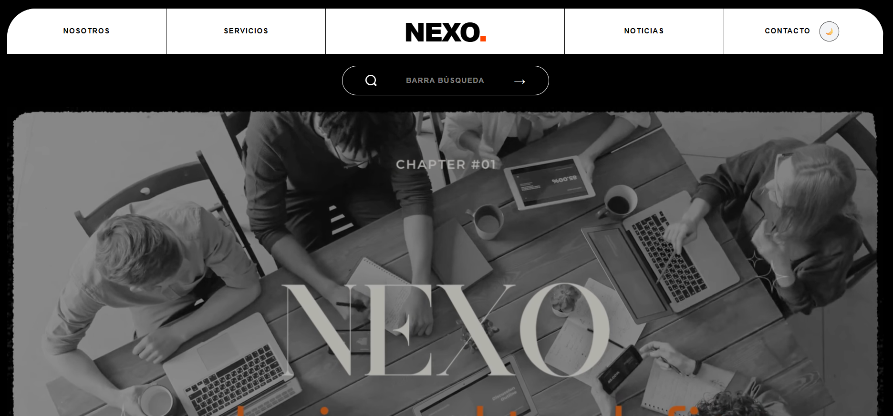
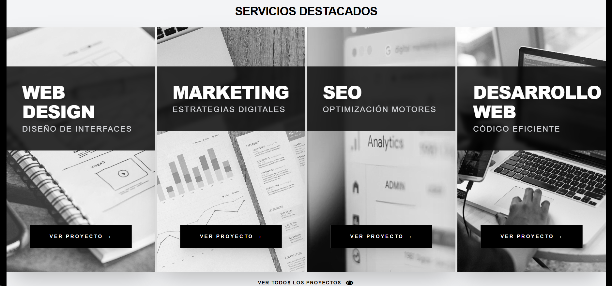
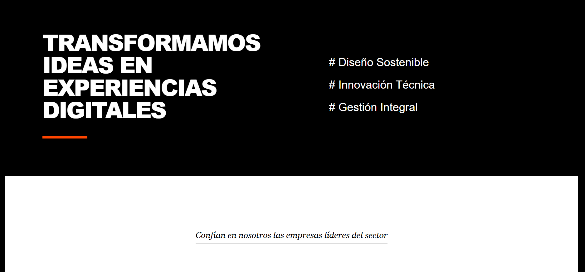
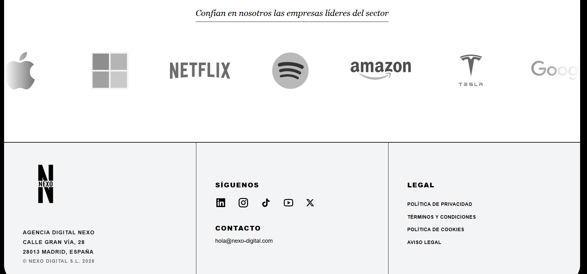

# 🌀 NEXO | Digital Agency

[](https://nexo-agency.vercel.app)
[](https://tailwindcss.com)
[](https://www.figma.com/design/a8AAK746hXraemkUnJdsL5/Web-Agencia-Marketing?node-id=3-45&t=5UXg0Q81GzOU0rGd-1)

**NEXO** es una página web diseñada para una agencia de marketing de vanguardia. El proyecto destaca por su estética **Brutalista y Minimalista**, basada en el estilo suizo, con una retícula expuesta y una jerarquía tipográfica agresiva.

---

## 📸 Capturas de Pantalla

### 🏠 Navbar + Sección Hero 


### 💻 Nuestros servicios


### 🌀 Nuestra Filosofía


### 🧑‍💼 Sección de partens y footer


> *Vista previa de la interfaz en los diferentes módulos principales.*

---

## 🚀 Live Demo
Puedes ver la aplicación desplegada en tiempo real aquí:
👉 **[Nexo | Digital Agency](https://xni0.github.io/marketing-home/)**

---

## 🖼️ Estilo Visual: Brutalismo Suizo Moderno

NEXO no es solo una web, es una declaración de intenciones estética. El diseño se basa en tres pilares fundamentales:

### 1. Retícula Expuesta (The Grid)
Siguiendo la escuela del **Diseño Suizo**, la estructura de la página no se oculta. Se utilizan bordes definidos de 2px para separar secciones, creando una sensación de orden técnico, robustez y transparencia.

### 2. Tipografía Agresiva
La jerarquía se dicta mediante el peso y no solo el color.
* **Titulares (Black 900):** Gigantes y en mayúsculas para un impacto visual inmediato.
* **Contraste Técnico:** Uso de itálicas y tracking negativo para acentuar el carácter brutalista y la precisión.

### 3. Minimalismo de Alto Contraste
El sistema está diseñado para funcionar en un entorno binario de máxima legibilidad. 
* **Modos Dinámicos:** Una transición fluida entre blanco puro y negro absoluto que redefine la interfaz según la preferencia del usuario.
* **Nexo Orange (#FF4500):** El único color de acento, utilizado quirúrgicamente para guiar la atención hacia las llamadas a la acción (CTAs) y elementos clave.

---

## 🎨 Sistema de Diseño (Atomic Design)

El proyecto ha sido construido bajo un sistema de diseño estricto definido en **Figma**, utilizando variables semánticas para garantizar consistencia absoluta entre diseño y código.

### 🛠 Figma Specs
Accede al archivo original de diseño para revisar los tokens de color, la escala tipográfica y el layout grid:
🔗 **[Figma Project Link](https://www.figma.com/design/a8AAK746hXraemkUnJdsL5/Web-Agencia-Marketing?node-id=3-45&t=5UXg0Q81GzOU0rGd-1)**

---

## 🛠 Tech Stack

* **Frontend:** React.js (Vite)
* **Estilos:** Tailwind CSS (Configuración personalizada de variables de Figma)
* **Animaciones:** Framer Motion (Scroll reveal, Entry animations, Carousels)
* **Icons:** SVG optimizados para máxima nitidez
* **Deploy:** Github-pages

---

## 📦 Instalación y Configuración

1.  **Clona el repositorio:**
    ```bash
    git clone https://github.com/xni0/marketing-home
    ```
2.  **Instala las dependencias:**
    ```bash
    npm install
    ```
3.  **Inicia el servidor de desarrollo:**
    ```bash
    npm run dev
    ```

---

## 📂 Estructura del Proyecto

```text
src/
├── assets/           # Imágenes, Vídeos e Iconos SVG optimizados
├── components/       # Componentes de UI atómicos (Cards, Navbar, UI elements)
├── pages/            # Home, About, Servicios
├── tailwind.config.js # Configuración de variables de Figma 
└── App.jsx           # Enrutamiento y estructura global del proyecto
````
---
💻 Proyecto realizado para el módulo de **Diseño de interfaces web**.
